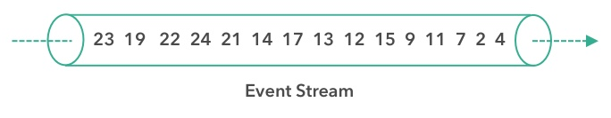
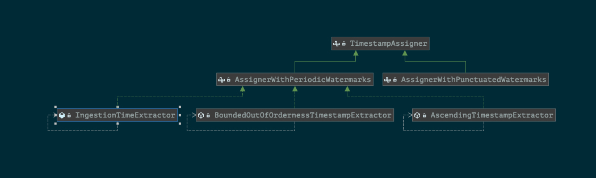

## 理解Watermark



一个带有时间戳的事件流，但是由于某种原因它们并不是按顺序到达的。假设我们处理这样一个乱序到达的事件流，并按照事件时间的顺序输出事件。

### 理解1


数据流中的第一个元素的时间是 4，但是我们不能直接将它作为排序后数据流的第一个元素并输出它。因为数据是乱序到达的，也许有一个更早发生的数据还没有到达。事实上，我们能预见一些这个流的未来，也就是我们的排序算子至少要等到 2 这条数据的到达再输出结果。

**有缓存，就必然有延迟。**

### 理解2

如果我们做错了，我们可能会永远等待下去。首先，我们的应用程序从看到时间 4 的数据，然后看到时间 2 的数据。是否会有一个比时间 2 更早的数据到达呢？也许会，也许不会。我们可以一直等下去，但可能永远看不到 1 。

**最终，我们必须勇敢地输出 2 作为排序流的第一个结果。**

### 理解3

我们需要的是某种策略，它定义了对于任何带时间戳的事件流，何时停止等待更早数据的到来。

**这正是 watermark 的作用，他们定义了何时不再等待更早的数据。**

Flink 中的事件时间处理依赖于一种特殊的带时间戳的元素，成为 watermark，它们会由数据源或是 watermark 生成器插入数据流中。具有时间戳 t 的 watermark 可以被理解为断言了所有时间戳小于或等于 t 的事件都（在某种合理的概率上）已经到达了。

### 理解4

**我们可以设想不同的策略来生成 watermark。**

我们知道每个事件都会延迟一段时间才到达，而这些延迟差异会比较大，所以有些事件会比其他事件延迟更多。一种简单的方法是假设这些延迟不会超过某个最大值。Flink 把这种策略称作 “有界无序生成策略”（bounded-out-of-orderness）。当然也有很多更复杂的方式去生成 watermark，但是对于大多数应用来说，固定延迟的方式已经足够了。

如果想要构建一个类似排序的流应用，可以使用 Flink 的 ProcessFunction。它提供了对事件时间计时器（基于 watermark 触发回调）的访问，还提供了可以用来缓存数据的托管状态接口。


一句话总结：**Watermark的意义之一在于它允许应用控制结果的完整性和延迟。** 如果watermark和消息的时间戳非常接近，那结果的处理延迟就会很低，因为任务无须等待过多的记录就可以触发最终计算。但同时结果的完整性可能会受到影响。


## 生成watermark

### source function 中生成watermark

 SourceFunction 里有两个方法产生 watermark：

通过 collectWithTimestamp 方法发送一条数据，其中第一个参数就是我们要发送的数据，第二个参数就是这个数据所对应的时间戳；也可以调用 emitWatermark 方法去产生一条 watermark，表示接下来不会再有时间戳小于等于这个数值记录。
  ```
  @Override
  public void run(SourceContext<MyType> ctx) throws Exception {
  	while (/* condition */) {
  		MyType next = getNext();
  		ctx.collectWithTimestamp(next, next.getEventTimestamp());
  
  		if (next.hasWatermarkTime()) {
  			ctx.emitWatermark(new Watermark(next.getWatermarkTime()));
  		}
  	}
  }
  
  ```

### Timestamp Assigners / Watermark Generators

DataStream API 中TimestampAssigner 接口定义了时间戳的提取行为，其中有两个不同的接口，分别代表了不同的watremark 生成策略。



AssignerWithPeriodicWatermarks 是周期生成Watremark 策略的顶层抽象接口，该接口的实现类周期性的生成Watermark，而不会针对每一个时间都生成。
AssignerWithPunctuatedWatermarks 对每一个时间都会尝试进行生成Watermark，但是如果生成的watermark 是null 或者watermark 小于之前的watermark，则该watermark 不会发往下游。

```
DataStream<MyEvent> withTimestampsAndWatermarks = stream
        .filter( event -> event.severity() == WARNING )
        .assignTimestampsAndWatermarks(new MyTimestampsAndWatermarks());

```

#### With Periodic Watermarks

```
/**
 * This generator generates watermarks assuming that elements arrive out of order,
 * but only to a certain degree. The latest elements for a certain timestamp t will arrive
 * at most n milliseconds after the earliest elements for timestamp t.
 */
public class BoundedOutOfOrdernessGenerator implements AssignerWithPeriodicWatermarks<MyEvent> {

    private final long maxOutOfOrderness = 3500; // 3.5 seconds

    private long currentMaxTimestamp;

    @Override
    public long extractTimestamp(MyEvent element, long previousElementTimestamp) {
        long timestamp = element.getCreationTime();
        currentMaxTimestamp = Math.max(timestamp, currentMaxTimestamp);
        return timestamp;
    }

    @Override
    public Watermark getCurrentWatermark() {
        // return the watermark as current highest timestamp minus the out-of-orderness bound
        return new Watermark(currentMaxTimestamp - maxOutOfOrderness);
    }
}

/**
 * This generator generates watermarks that are lagging behind processing time by a fixed amount.
 * It assumes that elements arrive in Flink after a bounded delay.
 */
public class TimeLagWatermarkGenerator implements AssignerWithPeriodicWatermarks<MyEvent> {

	private final long maxTimeLag = 5000; // 5 seconds

	@Override
	public long extractTimestamp(MyEvent element, long previousElementTimestamp) {
		return element.getCreationTime();
	}

	@Override
	public Watermark getCurrentWatermark() {
		// return the watermark as current time minus the maximum time lag
		return new Watermark(System.currentTimeMillis() - maxTimeLag);
	}
}

```


#### With Punctuated Watermarks

```
dataStream.assignTimestampsAndWatermarks(new AssignerWithPunctuatedWatermarks<T>() {
                    @Override
                    public Watermark checkAndGetNextWatermark(T lastElement, long extractedTimestamp) {
                        // 实现逻辑
                        return new Watermark(extractedTimestamp);
                    }

                    @Override
                    public long extractTimestamp(T element, long previousElementTimestamp) {
                        return getTimeStamp(element);
                    }
                })

```

### Flink SQL watermark

Flink SQL 没有DataStream API 开发那么灵活，其Watermark 生成主要是在TableSource中完成的。

像窗口（在 Table API 和 SQL ）这种基于时间的操作，需要有时间信息。因此，Table API 中的表就需要提供逻辑时间属性来表示时间，以及支持时间相关的操作。

每种类型的表都可以有时间属性，可以在用CREATE TABLE DDL创建表的时候指定、也可以在 DataStream 中指定、也可以在定义 TableSource 时指定。一旦时间属性定义好，它就可以像普通列一样使用，也可以在时间相关的操作中使用。

只要时间属性没有被修改，而是简单地从一个表传递到另一个表，它就仍然是一个有效的时间属性。时间属性可以像普通的时间戳的列一样被使用和计算。一旦时间属性被用在了计算中，它就会被物化，进而变成一个普通的时间戳。普通的时间戳是无法跟 Flink 的时间以及watermark等一起使用的，所以普通的时间戳就无法用在时间相关的操作中。

Table API 程序需要在 streaming environment 中指定时间属性：

## 多流watermark

对于有着两条或者多条输入数据流的算子，如Union或者CoFlatMap，它们的任务同样是利用全部分区水位线中的最小值来计算时间的时钟，并没有考虑分区是否来自不同的输入流。这导致所有的输入的记录都必须基于同一个事件时钟来处理。

Flink的watermark的处理与传播算法保证了算子任务所发出的时间戳和watermark一定会对齐。但是，这依赖于：所有的分区都会持续提供自增的watermark。只要有一个分区watermark的没有前进，或分区完全空闲下来不再发送任务记录或者watermark，任务的事件时间时钟就不会向前推进，进而导致计时器无法触发。因此，如果一个任务没有从全部输入任务以常规间隔接收新的watermark，就会导致时间相关算子的处理延迟或者状态大小的激增。  

当算子两个输入流的watermark差距很大时，也会产生类似的影响。对于一个有两个输入流的任务而言，其事件的时间戳会受制于那个相对较慢的流，较快流的记录或中间结果会在状态中缓冲，直到事件时间或者时钟到达允许处理它们的那个时间点。


## 延迟数据处理

DataStream API提供了不同的选项来应对迟到事件：

- 简单的将其丢弃
- 将迟到的数据重定向到单独的数据流中
- 根据迟到事件更新并发出计算结果

#### 丢弃迟到事件

处理迟到时间最简单的方式就是直接将其丢弃，这也是时间窗口的默认行为。

#### 重定向迟到事件

可以利用副输出将迟到的时间重定向另一个DataStream，这样就可以对其进行后续的处理，根据业务需求，迟到数据可通过定期的backfill process 集成到流式应用的结果中。

```java
env
                .socketTextStream("localhost", 9999)
                .flatMap(new Splitter())
                .keyBy(value -> value.f0)
                .timeWindow(Time.seconds(5))
                .sideOutputLateData(new OutputTag<>("late-record"))
                .process(new ProcessWindowFunction<Tuple2<String, Integer>, Tuple2<String, Integer>, String, TimeWindow>() {
                    OutputTag outputTag = new OutputTag<Tuple2<String, Integer>>("late-record");
                    @Override
                    public void process(String s, Context context, Iterable<Tuple2<String, Integer>> elements, Collector<Tuple2<String, Integer>> out) throws Exception {
                        
                        elements.forEach(e -> {
                            // 赋值timestamp
                            long timestamp = getTimeStamp();
                            if (timestamp < context.currentWatermark()){
                                 context.output(outputTag,e);
                            }else{
                                out.collect(e);
                            }
                        });
                        
                   
                    }
                });
```


#### 基于迟到事件更新结果

如果想要重新计算和更新结果，就必须考虑几个问题：

1. 需要保留用户再次计算结果的状态
2. 通常无法保留所有状态，最终还是需要在某个时间点将其清除
3. 一旦清除了针对特定结果的状态，这些结果就再也无法更新，而迟到的事件也只能被丢弃或重定向

窗口算子API提供了一个方法，可用来声明支持迟到的元素。在使用时间窗口时，可以指定allowed lateness，配置了该属性的窗口算子在watermark超过窗口的结束时间戳之后不会立刻删除窗口，而是会将窗口继续保留该延迟容忍度的时间。


```java
    env
                .socketTextStream("localhost", 9999)
                .flatMap(new Splitter())
                .keyBy(value -> value.f0)
                .timeWindow(Time.seconds(5)).allowedLateness(Time.seconds(5))
                .sum(1);
```

