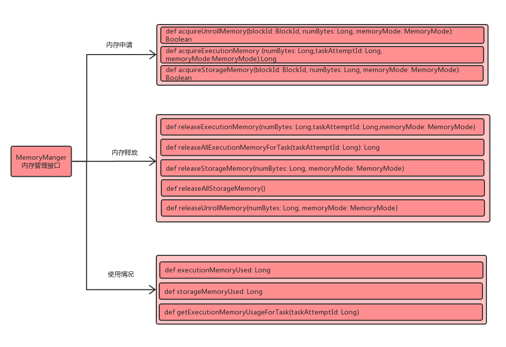

## 1. spark内存管理

Spark内数据存储和计算提供了统一的内存管理接口：MemoryManager。MemoryManager 包括StaticMemoryManager 和 UnifiedMemoryManager 两种。在Driver端，创建SparkEnv时，会根据配置选择创建不同的内存管理实现。

```
    val useLegacyMemoryManager = conf.getBoolean("spark.memory.useLegacyMode", false)
    val memoryManager: MemoryManager =
      if (useLegacyMemoryManager) {
        new StaticMemoryManager(conf, numUsableCores)
      } else {
        UnifiedMemoryManager(conf, numUsableCores)
      }
  
```
在spark 2.0之后，spark.memory.useLegacyMode 默认为false，统一采用UnifiedMemoryManager方式管理内存。相比于StaticMemoryManager，统一内存管理(UnifiedMemoryManager)中，存储内存和计算内存能够共享同一个空间，并且可以动态使用彼此的空闲区域。

### 1.1 内存模式

```
  /**
   * Tracks whether Tungsten memory will be allocated on the JVM heap or off-heap using
   * sun.misc.Unsafe.
   */
  final val tungstenMemoryMode: MemoryMode = {
    if (conf.get(MEMORY_OFFHEAP_ENABLED)) {
      require(conf.get(MEMORY_OFFHEAP_SIZE) > 0,
        "spark.memory.offHeap.size must be > 0 when spark.memory.offHeap.enabled == true")
      require(Platform.unaligned(),
        "No support for unaligned Unsafe. Set spark.memory.offHeap.enabled to false.")
      MemoryMode.OFF_HEAP
    } else {
      MemoryMode.ON_HEAP
    }
  }

```

MemoryManager 将内存分为堆内内存和堆外内存。堆内内存通常由用户通过参数(spark.driver.memory和spark.executor.memory)配置driver和executor内存的大小。Executor内存使用比较广泛，比如缓存RDD中的数据或广播变量、执行Join或者Aggregation计算任务是Shuffle操作等。同一个Executor中并发的Task会共享JVM内存。堆内存的申请与释放，实际上都是由JVM完成的，而Spark对堆内内存的管理只是做了记录和规划。但是堆内内存依赖于JVM，使得Spark无法完全摆脱GC带来的开销，所以，Spark用到了堆外内存。Spark堆外内存默认是关闭的，需要通过参数(*spark.memory.offHeap.enabled*)开启，通过参数(*spark.memory.offHeap.size*)控制堆外内存空间的大小。

### 1.2 内存池

```
  // -- Methods related to memory allocation policies and bookkeeping ------------------------------

  @GuardedBy("this")
  protected val onHeapStorageMemoryPool = new StorageMemoryPool(this, MemoryMode.ON_HEAP)
  @GuardedBy("this")
  protected val offHeapStorageMemoryPool = new StorageMemoryPool(this, MemoryMode.OFF_HEAP)
  @GuardedBy("this")
  protected val onHeapExecutionMemoryPool = new ExecutionMemoryPool(this, MemoryMode.ON_HEAP)
  @GuardedBy("this")
  protected val offHeapExecutionMemoryPool = new ExecutionMemoryPool(this, MemoryMode.OFF_HEAP)
  
```
MemoryManger通过内存池管理内存。MemoryPool有StorageMemoryPool和ExecutionMemoryPool两种实现，分别对象数据存储和计算执行。

### 1.3 内存页

```

  val pageSizeBytes: Long = {
    val minPageSize = 1L * 1024 * 1024   // 1MB
    val maxPageSize = 64L * minPageSize  // 64MB
    val cores = if (numCores > 0) numCores else Runtime.getRuntime.availableProcessors()
    // Because of rounding to next power of 2, we may have safetyFactor as 8 in worst case
    val safetyFactor = 16
    val maxTungstenMemory: Long = tungstenMemoryMode match {
      case MemoryMode.ON_HEAP => onHeapExecutionMemoryPool.poolSize
      case MemoryMode.OFF_HEAP => offHeapExecutionMemoryPool.poolSize
    }
    val size = ByteArrayMethods.nextPowerOf2(maxTungstenMemory / cores / safetyFactor)
    val default = math.min(maxPageSize, math.max(minPageSize, size))
    conf.getSizeAsBytes("spark.buffer.pageSize", default)
  }

```

MemoryManager 设置了默认的内存分页的大小，用户可以通过参数(*spark.buffer.pageSize*)设置其大小。如果用户没有设置，spark会用上面的代码进行计算pageSize。

```
minPageSize = 1L * 1024 * 1024   // 1MB
maxPageSize = 64L * minPageSize  // 64MB
safetyFactor = 16
size = nextPowerOf2(maxTungstenMemory / cores / safetyFactor)
default = min(maxPageSize, math.max(minPageSize, size))
```

### 1.4 内存管理接口
MemoryManager 提供了3个方面的内存管理接口，包括内存申请、释放、获取内存使用情况的接口。




1、可用堆内存空间

```
可用的存储内存 = systemMaxMemory * spark.storage.memoryFraction(deprecated) * spark.storage.safetyFraction
可用的执行内存 = systemMaxMemory * spark.shuffle.memoryFraction(deprecated) * spark.shuffle.safetyFraction
```