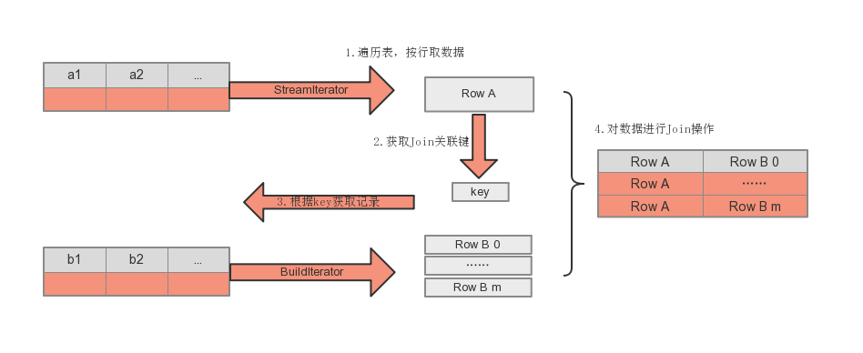
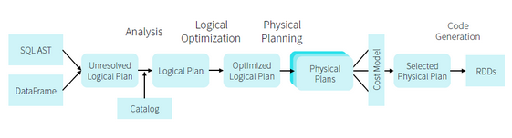
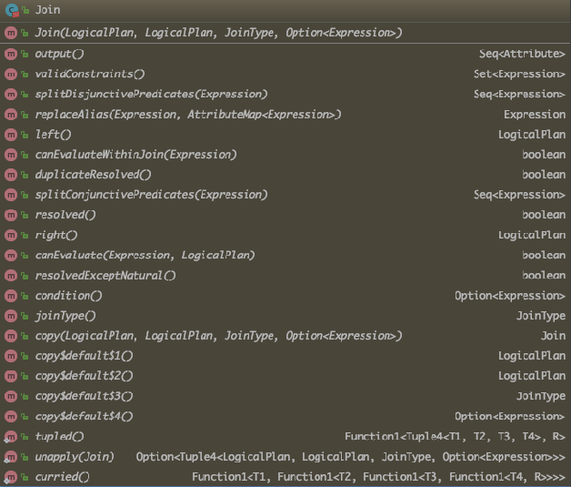
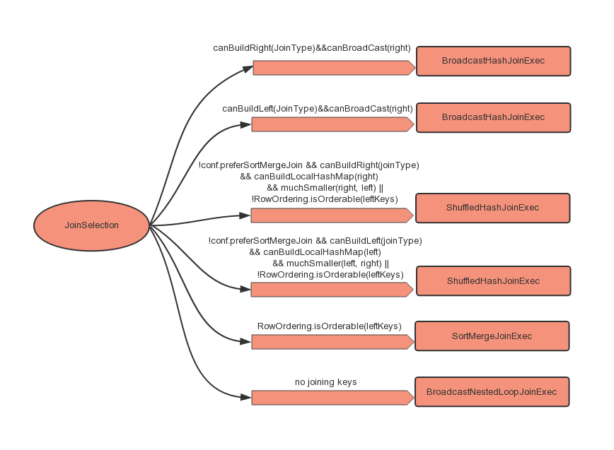

### Spark所支持的Join类型

- Inner Join

- Left Outer Join
    
- Right outer Join

- Full Outer Join 

- Left Semi Join `select A.id from A where A.id in (select id from B)`
- Left Anti Join `select A.id form A where A.id not in (select id from B)`
- Cross Join  笛卡尔积


### Joins实现的基本流程

Spark将参与Join的两张表抽象为流式遍历表(streamIter)和查找表(buildIter)，系统会默认将大表设为streamIter，小表设为buildIter。遍历streamIter中每条记录，然后再buildIter种查找相匹配的记录。这个查找过程称为Build过程，每次Build操作的结果为一条JoinedRow(A,B)，其中A来自streamIter，B来自buildIter，这个过程为BuildRight操作；如果B来自streamIter，A来自buildIter，则为BuildLeft操作。LeftOuter，RightOuter，LeftSemi和LeftAnti,它们的Build类型是确定的，即LeftOuter，LeftSemi和LeftAnti为BuildRight,RightOuter为BuildLeft类型，对于Inner，BuildLeft和BuildRight两种都可以，选择不同，可能有着很大的性能区别。



## Spark SQL解析流程


### Spark 逻辑计划生成
逻辑计划生成阶段是由AstBuild 将抽象的语法树(AST) 生成Unresolved LogicalPlan开始，然后在此基础上经过解析得到Analyzed LogicalPlan,最后经过优化得到Optimized LogicalPlan

#### Unresolved LogicalPlan
与Join相关的部分主要在From 子句中，逻辑计划是由AstBuild类中 的visitFromClause方法开始的，代码如下：

```
  override def visitFromClause(ctx: FromClauseContext): LogicalPlan = withOrigin(ctx) {
    val from = ctx.relation.asScala.foldLeft(null: LogicalPlan) { (left, relation) =>
      val right = plan(relation.relationPrimary)
      val join = right.optionalMap(left)(Join(_, _, Inner, None))
      withJoinRelations(join, relation)
    }
    ctx.lateralView.asScala.foldLeft(from)(withGenerate)
  }
```
从FromClauseContext 获取的relation 是RelationContext 的列表，每个RelationContext 代表一个通过Join连接的数据表计划，每个RelationContext中有一个主要的数据表(relationPrimary)和多个需要Join连接的表(JoinRelationContext)。从上述代码逻辑可知，对List<RelationContext>做foldLedf操作，将已经生成的逻辑计划与relation.relationPrimary结合得到Join算子(optionalMap方法)，然后将生成的Join算子加入新的逻辑计划中。

```
  private def withJoinRelations(base: LogicalPlan, ctx: RelationContext): LogicalPlan = {
    ctx.joinRelation.asScala.foldLeft(base) { (left, join) =>
      withOrigin(join) {
        val baseJoinType = join.joinType match {
          case null => Inner
          case jt if jt.CROSS != null => Cross
          case jt if jt.FULL != null => FullOuter
          case jt if jt.SEMI != null => LeftSemi
          case jt if jt.ANTI != null => LeftAnti
          case jt if jt.LEFT != null => LeftOuter
          case jt if jt.RIGHT != null => RightOuter
          case _ => Inner
        }

        // Resolve the join type and join condition
        val (joinType, condition) = Option(join.joinCriteria) match {
          case Some(c) if c.USING != null =>
            (UsingJoin(baseJoinType, c.identifier.asScala.map(_.getText)), None)
          case Some(c) if c.booleanExpression != null =>
            (baseJoinType, Option(expression(c.booleanExpression)))
          case None if join.NATURAL != null =>
            if (baseJoinType == Cross) {
              throw new ParseException("NATURAL CROSS JOIN is not supported", ctx)
            }
            (NaturalJoin(baseJoinType), None)
          case None =>
            (baseJoinType, None)
        }
        Join(left, plan(join.right), joinType, condition)
      }
    }
  }

```
在withJoinRelations方法中，首先会根据SQL语句中的Join类型构造JoinType对象，然后再此基础上判断查询中是否包含了USING等关键字，并并一步的封装，最终得到一个Join对象的逻辑计划。
        
        

#### Analyzed LogicalPlan

在Analyzer类中，有很多的解析规则，与Join相关的则有ResolveRelations(解析数据表)、ResolveReferences(解析列)、ResolveNaturalAndUsingJoin(解析自然Join)等规则。而ResolveRelations规则的作用是从Catalog中找到表相关的基本信息，包括数据表存储格式、每一列列名和数据类型等。ResolveReferences 规则负责解析所有列信息，并且如果传入的算子根节点为Join类型，ResolveReferences.dedupRight方法会针对存在冲突的表达式创建一个新的逻辑计划，通过增加别名(Alias)的方式避免列属性的冲突。ResolveNaturalAndUsingJoin规则则是将NATUAL或USING类型的Join转换为普通的Join。

#### Optimized LogicalPlan
经过Analyzer的解析后，进入逻辑算子树的优化阶段：
1. 消除多余的别名 EliminateSubqueryAliases
2. 列剪裁 ColumnPruning
3. InferFiltersFromConstraints 保证连接条件都不为NULL
4. PushPredicateThroughJoin 对Join中连接条件可以下推到子节点的谓词进行下推操作。
5. PushDownPredicate 一般情况下，优化阶段会将过滤条件尽可能下推，PushDownPredicate规则，则是这个作用。

### Join 查询物理计划
#### 物理计划的生成
从logical Plan 到Physical Plan的生成是基于策略进行的，比如文件数据源策略、Join选择策略和基本算子策略等，共八种策略。
```
  override def strategies: Seq[Strategy] =
    experimentalMethods.extraStrategies ++
      extraPlanningStrategies ++ (
      DataSourceV2Strategy ::
      FileSourceStrategy ::
      DataSourceStrategy(conf) ::
      SpecialLimits ::
      Aggregation ::
      JoinSelection ::
      InMemoryScans ::
      BasicOperators :: Nil)
      
```
关于Join，说一下JoinSelection策略。在JoinSelection策略中，使用了ExtractEquiJoinKeys匹配模式提取Join算子中的连接条件。
```
/**
 * A pattern that finds joins with equality conditions that can be evaluated using equi-join.
 *
 * Null-safe equality will be transformed into equality as joining key (replace null with default
 * value).
 */
object ExtractEquiJoinKeys extends Logging with PredicateHelper {
  /** (joinType, leftKeys, rightKeys, condition, leftChild, rightChild) */
  type ReturnType =
    (JoinType, Seq[Expression], Seq[Expression], Option[Expression], LogicalPlan, LogicalPlan)
    
```

其主要逻辑如下：如果是等值连接(Equi-join)，则将左、右子节点的连接key都提取出来。此时存在两种情况，EqualTo和EqualNullSafe。两种的区别在于是否对空值(NULL)敏感，EqualTo对空值是敏感的。EqualNullSafe在一般情况下和EqualTo逻辑一样，但是它会对空值进行处理：赋予相应类型的默认值。这两种情况实际上和用户编写的SQL语句有关，当SQL语句中Join条件表达式为“=”或者“==”时，会对应EqualTo模式；当Join条件表达式为“<=>”时，会对应EqualNullSafe模式。此外，ExtractEquiJoinKeys中还通过otherPredicates记录出EqualTo和EqualNullSafe类型外的其他条件表达式，这些谓词基本上可以在Join算子执行Shuffle操作之后在各个数据集上分别处理。

#### 物理计划的选取

生成物理计划的过程中，JoinSelection根据若干条件判断采用何种类型的Join 执行方式。目前在Spark SQL中，Join执行方式主要有ShuffledHashJoinExec、BroadcastHashJoinExec、SortMergeJoinExec、CartesianProductExec、BroadcastNestedLoopJoinExec。JoinSelection中会有具体的逻辑匹配到各个Join执行方式。



在JoinSelection Join选取逻辑中，BroadcastHashJoinExec的优先级最高。它包含两种情况：

* 能够广播右表(canBroadcast(right))且右表能够“构建”(canBuildRight(joinType)),那么构造参数中传入的是BuildRight
* 能够广播左表(canBroadcast(Left))且左表能够“构建”(canBuildLeft(joinType)),那么构造参数中传入的是BuildLeft

优先级次之的是ShuffledHashJoinExec，这种类型的Join执行方式需要苛刻的条件：
1. 配置中需设置`spark.sql.join.perferSortMergeJoin=false`
2. 右表(左表)能够build，且能够buildLocalHashMap (当前逻辑计划的数据量小于数据广播阈值与Shufle分区数目的乘积)
3. 右表(左表)数据量要比左表(右表)数据量小很多(3倍以上)
4. (或)参与连接的key不具有排序属性

再次之的是 SortMergeJoin，最常见的Join执行方式。绝大部分Join的执行都是采用SortMergeJoinExec。

最后是不包含Join条件的语句。逻辑如下：
1. 判断是否执行广播操作。对应Buildleft和BuildRight两种情况，生成BroadcastNestedLoopJoinExec算子。
2. 如果不满足条件1，而Join类型是InnerLike，那么久选择CartesianProductExec执行方式
3. 如果以上情况都不满足，那么久选择两个数据表中数据量相对较少的表广播，执行BroadcastNestedLoopJoinExec算子

### Join查询执行

#### BroadcastHashJoinExec

这种Join的实现主营思想是对小表进行广播操作，避免打了Shuffle的产生。Join操作是对两个表中key值相对的记录进行连接，在SparkSql中，对两个表做Join操作最直接的方式是先根据key分区，然后再每个分区中把key值相同的记录提取出来进行连接操作。这种操作不可避免的会涉及数据的Shuffle，而Shuffle操作无论在哪个大数据框架中都是比较耗时的操作。因此当一个大表Join一个小表时，为了避免数据的Shuffle，可以将小表的全部数据分发到各个节点上，供大表Join使用。

在Spark SQL触发BroadcastHashJoinExec场景有：

* 被广播的表需要小于参数(spark.sql.autoBroadcastJoinThreshold)所设置的值，默认是10MB
* 在SQL语句中添加了Hint(MAPJOIN,BROADCASTJOIN或BROADCAST)

在outer类型的Join中，基表不能被广播，入A left outer Join B，只能广播B。Broadcast 表是一种网络密集型(network-intensive)操作,如果广播较大的表时，起开销远大于Shuffle的开销，且容易造成OOM。

#### ShuffledHashJoinExec

ShuffledHashJoinExec分两步：

1. 对两张表分别按照Join Key 进行重分区，即Shuffle，让有相同Key值的记录分到对应的分区中，这一步对应执行计划中的Exchange节点
2. 对每个对应分区中的数据进行Join操作，此处先将小表分区构造为一张Hash表,然后根据大分区表中记录的Key值进行匹配


#### SortMergeJoinExec
SortMergeJoinExec 实现方式并不用将一侧数据全部加载后再进行Join操作，其前提条件是需要再Join操作前将数据排序。为了让两条记录能连接到一起，需要将具有相同key的记录分发到同一分区，因此一般会进行一次Shuffle操作(Exchange)。进过Exchange操作后，分别对两个表中每个分区里的数据按照Key进行排序，然后进行merge sort操作。在遍历StreamIter 时，对每条记录都采用顺序查找的方式从构建查找表中查找对应的记录。由于排序的特性，每次处理完一条记录后只需要从上一次结束的位置开始查找，SortMergeJoinExec可以避免大量无用的操作。
