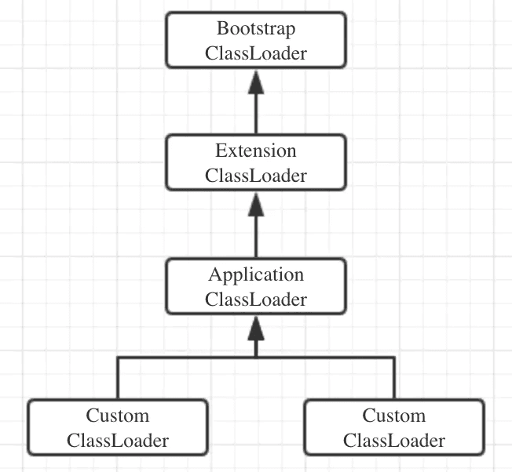
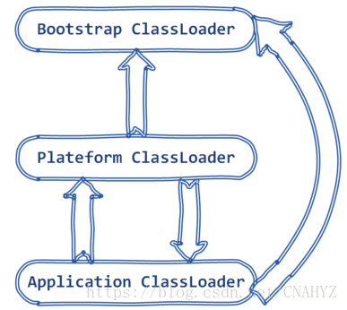

# Redis

## Redis 持久化机制

**Redis**是一个支持持久化的内存数据库，通过持久化机制把内存中的数据同步到硬盘文件来保证数据持久化。当Redis重启后通过把硬盘文件重新加载到内存，就能达到恢复数据的目的。
实现：单独创建fork()一个子进程，将当前父进程的数据库数据复制到子进程的内存中，然后由子进程写入到临时文件中，持久化的过程结束了，再用这个临时文件替换上次的快照文件，然后子进程退出，内存释放。

**RDB**是Redis默认的持久化方式。按照一定的时间周期策略把内存的数据以快照的形式保存到硬盘的二进制文件。即Snapshot快照存储，对应产生的数据文件为dump.rdb，通过配置文件中的save参数来定义快照的周期。（ 快照可以是其所表示的数据的一个副本，也可以是数据的一个复制品。）
**AOF：**Redis会将每一个收到的写命令都通过Write函数追加到文件最后，类似于MySQL的binlog。当Redis重启是会通过重新执行文件中保存的写命令来在内存中重建整个数据库的内容。
当两种方式同时开启时，数据恢复Redis会优先选择AOF恢复。

## 缓存雪崩
我们可以简单的理解为：由于原有缓存失效，新缓存未到期间
(例如：我们设置缓存时采用了相同的过期时间，在同一时刻出现大面积的缓存过期)，所有原本应该访问缓存的请求都去查询数据库了，而对数据库CPU和内存造成巨大压力，严重的会造成数据库宕机。从而形成一系列连锁反应，造成整个系统崩溃。
解决办法：
大多数系统设计者考虑用加锁（ 最多的解决方案）或者队列的方式保证来保证不会有大量的线程对数据库一次性进行读写，从而避免失效时大量的并发请求落到底层存储系统上。还有一个简单方案就时讲缓存失效时间分散开。

## 缓存穿透
缓存穿透是指用户查询数据，在数据库没有，自然在缓存中也不会有。这样就导致用户查询的时候，在缓存中找不到，每次都要去数据库再查询一遍，然后返回空（相当于进行了两次无用的查询）。这样请求就绕过缓存直接查数据库，这也是经常提的缓存命中率问题。
解决办法;
最常见的则是采用布隆过滤器，将所有可能存在的数据哈希到一个足够大的bitmap中，一个一定不存在的数据会被这个bitmap拦截掉，从而避免了对底层存储系统的查询压力。
另外也有一个更为简单粗暴的方法，如果一个查询返回的数据为空（不管是数据不存在，还是系统故障），我们仍然把这个空结果进行缓存，但它的过期时间会很短，最长不超过五分钟。通过这个直接设置的默认值存放到缓存，这样第二次到缓冲中获取就有值了，而不会继续访问数据库，这种办法最简单粗暴。
5TB的硬盘上放满了数据，请写一个算法将这些数据进行排重。如果这些数据是一些32bit大小的数据该如何解决？如果是64bit的呢？

对于空间的利用到达了一种极致，那就是Bitmap和布隆过滤器(Bloom Filter)。
Bitmap： 典型的就是哈希表
缺点是，Bitmap对于每个元素只能记录1bit信息，如果还想完成额外的功能，恐怕只能靠牺牲更多的空间、时间来完成了。

## 缓存击穿
指一个key非常热点，大并发集中对这个key进行访问，当这个key在失效的瞬间，仍然持续的大并发访问就穿破缓存，转而直接请求数据库。
解决方案;在访问key之前，采用SETNX（set if not exists）来设置另一个短期key来锁住当前key的访问，访问结束再删除该短期key。

## 单线程的redis为什么这么快

(一)纯内存操作
(二)单线程操作，避免了频繁的上下文切换
(三)采用了非阻塞I/O多路复用机制

## Redis 内部结构

**dict** 本质上是为了解决算法中的查找问题（Searching）是一个用于维护key和value映射关系的数据结构，与很多语言中的Map或dictionary类似。 本质上是为了解决算法中的查找问题（Searching）
**sds** sds就等同于char * 它可以存储任意二进制数据，不能像C语言字符串那样以字符’\0’来标识字符串的结 束，因此它必然有个长度字段。
**skiplist** 跳表是一种实现起来很简单，单层多指针的链表，它查找效率很高，堪比优化过的二叉平衡树，且比平衡树的实现，
**quicklist**
**ziplist** 压缩表 ziplist是一个编码后的列表，是由一系列特殊编码的连续内存块组成的顺序型数据结构，

## redis的过期策略以及内存淘汰机制

redis采用的是**定期删除**+**惰性删除策略**。
为什么不用定时删除策略?
定时删除,用一个定时器来负责监视key,过期则自动删除。虽然内存及时释放，但是十分消耗CPU资源。在大并发请求下，CPU要将时间应用在处理请求，而不是删除key,因此没有采用这一策略.
**定期删除+惰性删除是如何工作的呢?**
定期删除，redis默认每个100ms检查，是否有过期的key,有过期key则删除。需要说明的是，redis不是每个100ms将所有的key检查一次，而是随机抽取进行检查(如果每隔100ms,全部key进行检查，redis岂不是卡死)。因此，如果只采用定期删除策略，会导致很多key到时间没有删除。
于是，惰性删除派上用场。也就是说在你获取某个key的时候，redis会检查一下，这个key如果设置了过期时间那么是否过期了？如果过期了此时就会删除。
采用定期删除+惰性删除就没其他问题了么?
不是的，如果定期删除没删除key。然后你也没即时去请求key，也就是说惰性删除也没生效。这样，redis的内存会越来越高。那么就应该采用内存淘汰机制。

## Redis 为什么是单线程的

官方FAQ表示，因为Redis是基于内存的操作，CPU不是Redis的瓶颈，Redis的瓶颈最有可能是机器内存的大小或者网络带宽。既然单线程容易实现，而且CPU不会成为瓶颈，那就顺理成章地采用单线程的方案了（毕竟采用多线程会有很多麻烦！）Redis利用队列技术将并发访问变为串行访问
1）绝大部分请求是纯粹的内存操作（非常快速）2）采用单线程,避免了不必要的上下文切换和竞争条件
3）非阻塞IO优点：
1.速度快，因为数据存在内存中，类似于HashMap，HashMap的优势就是查找和操作的时间复杂度都是O(1)
2. 支持丰富数据类型，支持string，list，set，sorted set，hash
3.支持事务，操作都是原子性，所谓的原子性就是对数据的更改要么全部执行，要么全部不执行
4. 丰富的特性：可用于缓存，消息，按key设置过期时间，过期后将会自动删除如何解决redis的并发竞争key问题

同时有多个子系统去set一个key。这个时候要注意什么呢？ 不推荐使用redis的事务机制。因为我们的生产环境，基本都是redis集群环境，做了数据分片操作。你一个事务中有涉及到多个key操作的时候，这多个key不一定都存储在同一个redis-server上。因此，redis的事务机制，十分鸡肋。
(1)如果对这个key操作，不要求顺序： 准备一个分布式锁，大家去抢锁，抢到锁就做set操作即可
(2)如果对这个key操作，要求顺序： 分布式锁+时间戳。 假设这会系统B先抢到锁，将key1设置为{valueB 3:05}。接下来系统A抢到锁，发现自己的valueA的时间戳早于缓存中的时间戳，那就不做set操作了。以此类推。
(3) 利用队列，将set方法变成串行访问也可以redis遇到高并发，如果保证读写key的一致性
对redis的操作都是具有原子性的,是线程安全的操作,你不用考虑并发问题,redis内部已经帮你处理好并发的问题了。

## Redis 常见性能问题和解决方案？
(1) Master 最好不要做任何持久化工作，如 RDB 内存快照和 AOF 日志文件
(2) 如果数据比较重要，某个 Slave 开启 AOF 备份数据，策略设置为每秒同步一次
(3) 为了主从复制的速度和连接的稳定性， Master 和 Slave 最好在同一个局域网内
(4) 尽量避免在压力很大的主库上增加从库
(5) 主从复制不要用图状结构，用单向链表结构更为稳定，即： Master <- Slave1 <- Slave2 <-Slave3…

## Redis线程模型

文件事件处理器包括分别是**套接字**、 **I/O 多路复用程序**、 **文件事件分派器（dispatcher）**、 以及**事件处理器**。使用 I/O 多路复用程序来同时监听多个套接字， 并根据套接字目前执行的任务来为套接字关联不同的事件处理器。当被监听的套接字准备好执行连接应答（accept）、读取（read）、写入（write）、关闭（close）等操作时， 与操作相对应的文件事件就会产生， 这时文件事件处理器就会调用套接字之前关联好的事件处理器来处理这些事件。
I/O 多路复用程序负责监听多个套接字， 并向文件事件分派器传送那些产生了事件的套接字。

## 工作原理：
1)I/O 多路复用程序负责监听多个套接字， 并向文件事件分派器传送那些产生了事件的套接字。
尽管多个文件事件可能会并发地出现， 但 I/O 多路复用程序总是会将所有产生事件的套接字都入队到一个队列里面， 然后通过这个队列， 以有序（sequentially）、同步（synchronously）、每次一个套接字的方式向文件事件分派器传送套接字： 当上一个套接字产生的事件被处理完毕之后（该套接字为事件所关联的事件处理器执行完毕）， I/O 多路复用程序才会继续向文件事件分派器传送下一个套接字。如果一个套接字又可读又可写的话， 那么服务器将先读套接字， 后写套接字

## JVM

### JVM 内存模型

### 类的加载机制

**双亲委派模型**：如果一个类加载器要加载一个类，它首先不会自己尝试加载这个类，而是把加载的请求委托给父加载器完成，所有的类加载请求最终都应该传递给最顶层的启动类加载器。只有当父加载器无法加载到这个类时，子加载器才会尝试自己加载。

**加载**：类加载指的是将class文件读入内存，并为之创建一个java.lang.Class对象，即程序中使用任何类时，系统都会为之建立一个java.lang.Class对象，系统中所有的类都是java.lang.Class的实例，通常用以下几种方式加载类的二进制数据：
  - 从本地文件系统中读取class文件
  - 从JAR包中加载class文件
  - 通过网络加载class文件
  - 把一个Java源文件动态编译并执行加载
  
**链接**：连接阶段负责把类的二进制数据合并到JRE中，其又可分为如下三个阶段：
  - 验证：确保加载的类信息符合JVM规范，无安全方面的问题。
  - 准备：为类的静态Field分配内存，并设置初始值。
  - 解析：将类的二进制数据中的符号引用替换成直接引用。
 
**初始化** ： 该阶段主要是对静态Field进行初始化，在Java类中对静态Field指定初始值有两种方式
  - 声明时即指定初始值
  - 使用静态代码块为静态Field指定初始值
  
#### 类的加载器
   1. Bootstrap ClassLoader：负责加载Java的核心类（如String、System等），它比较特殊，因为它是由原生C++代码实现的，并不是java.lang.ClassLoader的子类
   2. Extension ClassLoader： 负责加载JRE的扩展目录（%JAVA_HOME%/jre/lib/ext）中JAR包的类，我们可以通过把自己开发的类打包成JAR文件放入扩展目录来为Java扩展核心类以外的新功能。
   3. System ClassLoader ： 负责在JVM启动时加载来自Java命令的-classpath选项、java.class.path系统属性，或CLASSPATH环境变量所指定的JAR包和类路径
#### 类的加载机制
  - 全盘负责：当一个类加载器加载某个Class时，该Class所依赖和引用的其它Class也将由该类加载器负责载入，除非显式的使用另外一个类加载器来载入
  - 双亲委派：当一个类加载器收到了类加载请求，它会把这个请求委派给父（parent）类加载器去完成，依次递归，因此所有的加载请求最终都被传送到顶层的启动类加载器中。只有在父类加载器无法加载该类时子类才尝试从自己类的路径中加载该类。
  - 缓存机制：缓存机制会保证所有加载过的Class都会被缓存，当程序中需要使用某个类时，类加载器先从缓冲区中搜寻该类，若搜寻不到将读取该类的二进制数据，并转换成Class对象存入缓冲区中
  
 #### java9的改变
  

  java9 新增 **Platform ClassLoader**，用于加载一些平台相关的模块，例如： java.activation 、 java.se 、 jdk.desktop 、 java.compiler 等，双亲是BootClassLoader。
  在JDK 9中，应用程序类加载器可以委托给平台类加载器以及引导类加载器；平台类加载器可以委托给引导类加载器和应用程序类加载器。
  JDK 9不再支持扩展机制。 但是，它将扩展类加载器保留在名为平台类加载器的新名称下。 ClassLoader类包含一个名为getPlatformClassLoader()的静态方法，该方法返回对平台类加载器的引用。
  
  #### java9类加载机制
  - 当应用程序类加载器需要加载类时，它将搜索定义到所有类加载器的模块。如果有合适的模块定义在这些类加载器中，则该类加载器将加载类，这意味着应用程序类加载器现在可以委托给引导类加载器和平台类加载器。如果在为这些类加载器定义的命名模块中找不到类，则应用程序类加载器将委托给其父类，即平台类加载器。 如果类尚未加载，则应用程序类加载器将搜索类路径。 如果它在类路径中找到类，它将作为其未命名模块的成员加载该类。 如果在类路径中找不到类，则抛出ClassNotFoundException异常。        
  - 当平台类加载器需要加载类时，它将搜索定义到所有类加载器的模块。 如果一个合适的模块被定义为这些类加载器中，则该类加载器加载该类。 这意味着平台类加载器可以委托给引导类加载器以及应用程序类加载器。 如果在为这些类加载器定义的命名模块中找不到一个类，那么平台类加载器将委托给它的父类，即引导类加载器。
  - 当引导类加载器需要加载一个类时，它会搜索自己的命名模块列表。 如果找不到类，它将通过命令行选项-Xbootclasspath/a指定的文件和目录列表进行搜索。 如果它在引导类路径上找到一个类，它将作为其未命名模块的成员加载该类。

### 线程池参数，线程间通信

### HashMap 与 ConcurrentHashMap  实现原理，jdk1.8 之后优化点

### Happen Before 的理解

### 应用启动缓慢如何优化

## 锁

### 对 Java 锁的理解 ，  synchronize，Lock

## 网络

### 理解的 HTTP 协议

### 对 TCP 的理解？三次握手？滑动窗口？

### 对 Netty 的理解？Netty 的线程模型
